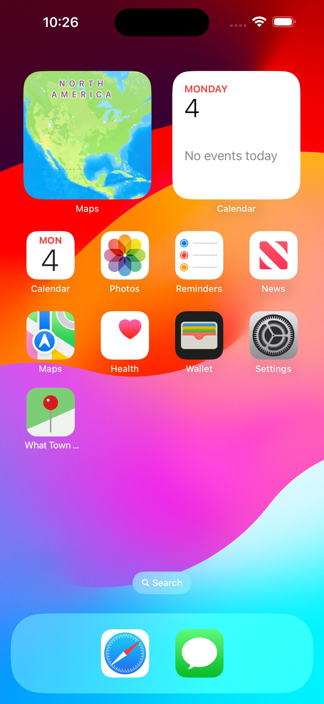
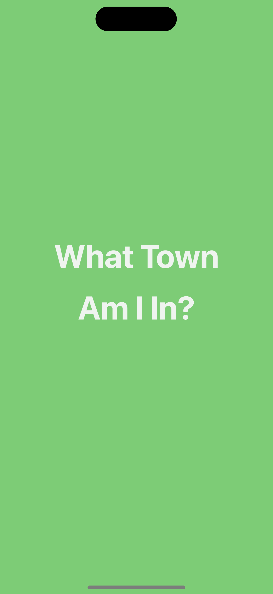
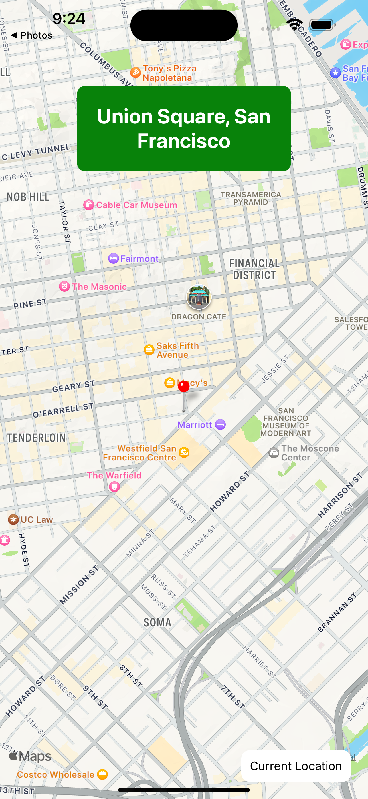

    

<h1 align="center"><strong>What Town Am I In?</strong></h1>

    
    
    
    

This mobile application uses your device's location to tell you what town you are currently in.

    
    
    

